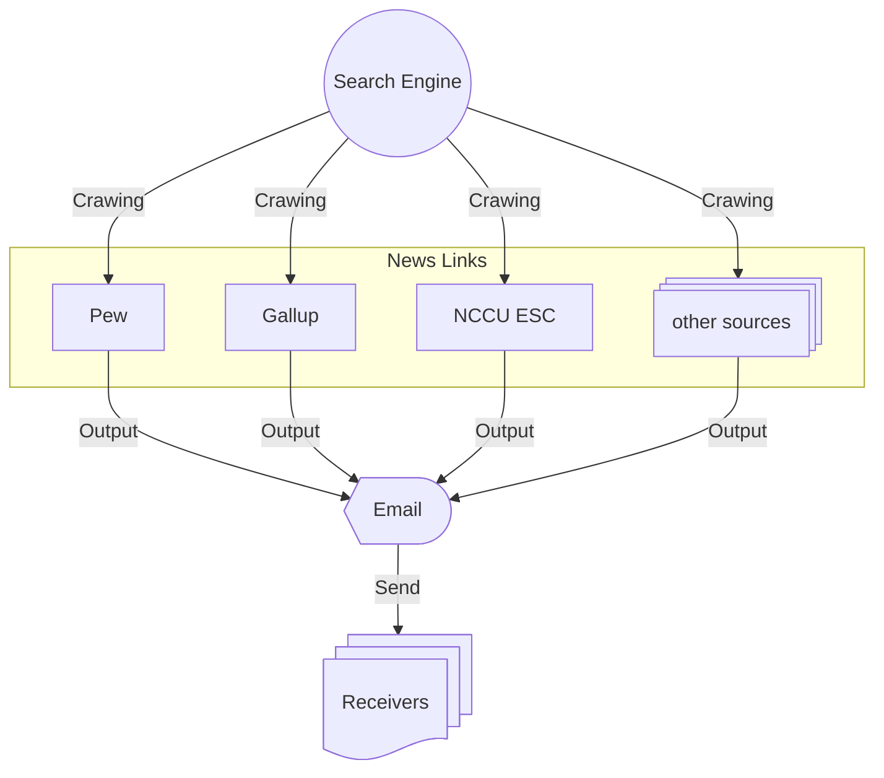

# Crawling Daily Survey & Poll News of the Cross-Strait Issue

## Introduction

The script aim to scrape on web and obtain the daily news of the latest survey or poll on the cross-strait issue automatically.

## Programming Schedule

- The program executes via the scheduling tool ``Cron``.
- The scheduling time: every **UTC+8** ``4 a.m.`` ``7 a.m.`` ``12 p.m.``

## Diagram

